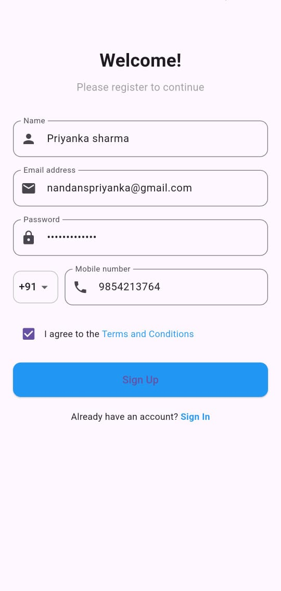
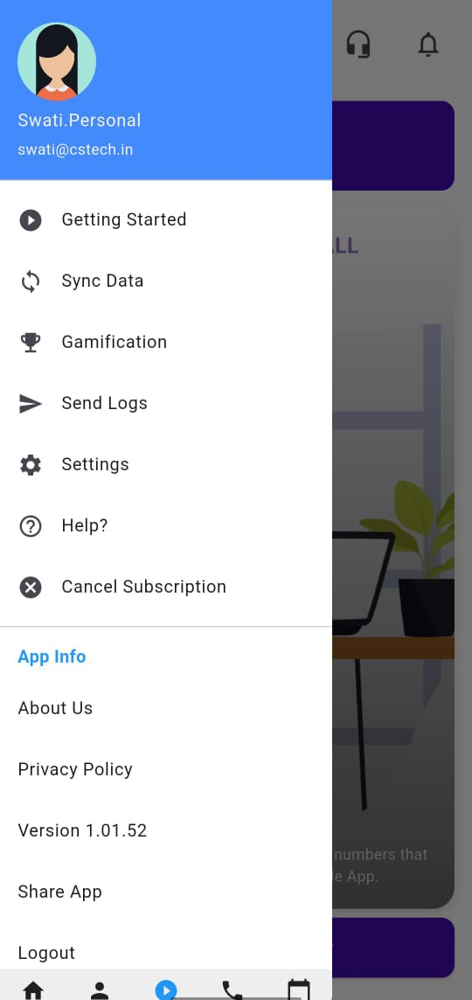
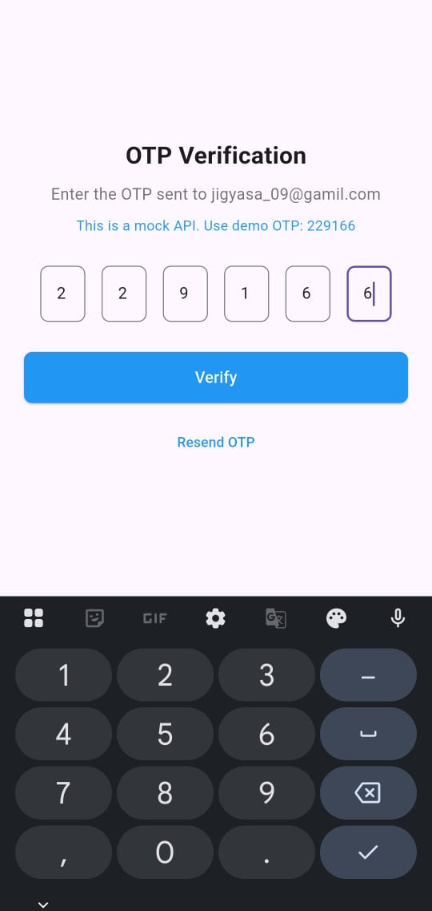
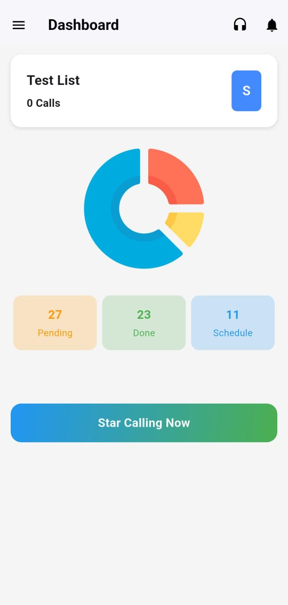

📱 Authentication App (Flutter + REST API)
🚀 Overview

This project demonstrates user authentication flow using Flutter and Dart, integrated with a mock backend REST API. It includes user registration, OTP verification, and navigation between screens, showcasing the fundamentals of authentication systems in mobile apps.

✨ Features

📌 User Registration Screen with form validation

📌 OTP Verification Screen (mock backend for demo)

📌 REST API integration with JSON parsing and model classes

📌 Left Drawer Navigation with profile and app info sections

📌 Responsive UI built using Flutter’s Material Design widgets

🛠️ Tech Stack

Language: Dart

Framework: Flutter

API Integration: REST API (mock backend for demo)

State Management: Basic setState and widget tree management

## Screenshots

#### Sign Up Screen

#### Dashboard Screen

#### OTP Verification Screen

#### Test List Screen

